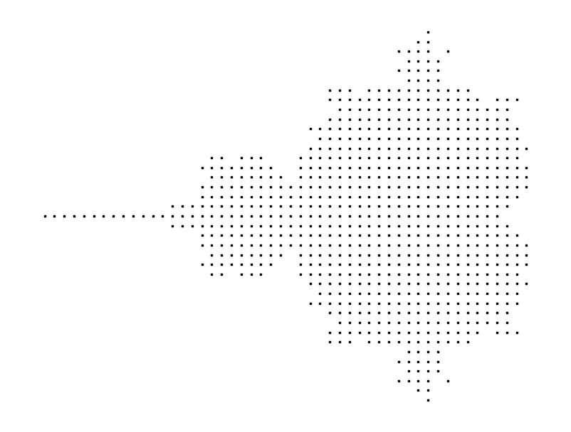
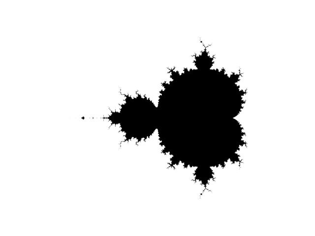

Este tutorial irá guiá-lo através de um projeto divertido envolvendo [números complexos em Python](https://realpython.com/python-complex-numbers/). Você aprenderá sobre fractais e criará uma arte verdadeiramente impressionante desenhando o **conjunto Mandelbrot** usando as bibliotecas Matplotlib e Pillow do Python. Ao longo do caminho, você aprenderá como esse famoso fractal foi descoberto, o que ele representa,
e como se relaciona com outros fractais.

Conhecer os princípios de [programação orientada a objetos](https://realpython.com/python3-object-oriented-programming/) e a [recursão](https://realpython.com/python-recursion/) permitirá que você aproveite ao máximo a sintaxe expressiva do Python para escrever um código limpo que se lê quase como fórmulas matemáticas. Para entender os detalhes algorítmicos de fazer fractais, você também deve estar confortável com [números complexos](https://en.wikipedia.org/wiki/Complex_number),
[logaritmos](https://en.wikipedia.org/wiki/Logarithm), [teoria dos conjuntos](https://en.wikipedia.org/wiki/Set_theory) e [funções iteradas](https://en.wikipedia.org/wiki/Iterated_function). Mas não deixe que esses pré-requisitos o assustem, pois você poderá acompanhar e produzir a arte de qualquer maneira!

Neste tutorial, você aprenderá como:

> ° Aplicar **números complexos** a um problema prático
>
> ° Encontre membros dos conjuntos **Mandelbrot e Julia**
>
> ° Desenhe esses conjuntos como **fractais** usando **Matplotlib e Pillow**
>
> ° Faça uma representação artística **colorida** dos fractais

# Entendendo o conjunto de Mandelbrot

Antes de tentar desenhar o fractal, será útil entender o que o conjunto de Mandelbrot correspondente representa e como determinar seus membros. Se você já estiver familiarizado com a teoria subjacente, sinta-se à vontade para pular para a [seção de plotagem](https://realpython.com/mandelbrot-set-python/#plotting-the-mandelbrot-set-using-pythons-matplotlib) abaixo.

## O ícone da geometria fractal

Mesmo que o nome seja novo para você, você pode ter visto algumas visualizações fascinantes do conjunto de Mandelbrot antes. É um conjunto de **números complexos**, cuja fronteira forma um padrão distinto e intrincado quando representado no [plano complexo](https://en.wikipedia.org/wiki/Complex_plane). Esse padrão tornou-se indiscutivelmente o [fractal](https://en.wikipedia.org/wiki/Fractal) mais famoso, dando origem à **geometria fractal** no final do século 20:


<p align="center">
  Mandelbrot Set (Source: Wikimedia, Created by Wolfgang Beyer, CC BY-SA 3.0)
</p>


A descoberta do conjunto de Mandelbrot foi possível graças ao avanço tecnológico. É atribuído a um matemático chamado [Benoît Mandelbrot](https://en.wikipedia.org/wiki/Benoit_Mandelbrot). Ele trabalhava na IBM e tinha acesso a um computador capaz de fazer o que, na época, exigia cálculos numéricos. Hoje, você pode explorar fractais no conforto de sua casa, usando nada mais do que Python!

Os fractais são padrões que se **repetem infinitamente** em diferentes escalas. Enquanto os filósofos argumentam há séculos sobre a existência do infinito, os fractais têm uma analogia no mundo real. É um fenômeno bastante comum que ocorre na natureza. Por exemplo, esta couve-flor Romanesco é finita, mas tem uma estrutura **semelhante** porque cada parte do vegetal se parece com o todo, só que menor:


<p align="center">
  Fractal Structure of a Romanesco Cauliflower
</p>

## O limite da estabilidade iterativa

Formalmente, o conjunto de Mandelbrot é o conjunto de números complexos, _c_, para os quais uma sequência infinita de números, _z0, z1, …, zn, …,_ permanece [limitada](https://en.wikipedia.org/wiki/Bounded_function). Em outras palavras, existe um limite que a magnitude de cada número complexo nessa sequência nunca excede. A sequência de Mandelbrot é dada pela seguinte fórmula recursiva:


Em linguagem simples, para decidir se algum número complexo, _c_, pertence ao conjunto de Mandelbrot, você deve inserir esse número na fórmula acima. De agora em diante, o número c permanecerá constante enquanto você itera a sequência. O primeiro elemento da sequência, _z0_, é sempre igual a zero. Para calcular o próximo elemento, _z(n+1)_,
você continuará **elevando** ao quadrado o último elemento, _z(n)_, e **adicionando** seu número inicial, _c_, em um loop de feedback.

Em linguagem simples, para decidir se algum número complexo, _c_, pertence ao conjunto de Mandelbrot, você deve inserir esse número na fórmula acima. De agora em diante, o número _c_ permanecerá constante enquanto você itera a sequência. O primeiro elemento da sequência, _z0_, é sempre igual a zero. Para calcular o próximo elemento, _z(n+1)_,
você continuará **elevando** ao quadrado o último elemento, _z(n)_, e **adicionando** seu número inicial, _c_, em um loop de feedback.

Ao observar como a sequência de números resultante se comporta, você poderá classificar seu número complexo, _c_, como um membro do conjunto de Mandelbrot ou não. A sequência é infinita, mas você deve parar de calcular seus elementos em algum momento. Fazer essa escolha é um tanto arbitrário e depende do seu nível de confiança aceito, pois mais elementos fornecerão uma decisão mais precisa sobre _c_.

> ° **Nota:** Todo o conjunto de Mandelbrot se encaixa em um círculo com um raio de dois quando representado no plano complexo. Este é um fato útil que permitirá pular muitos cálculos desnecessários para pontos que certamente não pertencem ao conjunto.

Com números complexos, você pode imaginar esse processo iterativo visualmente em duas dimensões, mas pode ir em frente e considerar apenas números reais para simplificar agora. Se você implementasse a equação acima em Python, poderia ser algo assim:

```python
def z(n, c):
    if n == 0:
        return 0
    else:
        return z(n - 1, c) ** 2 + c
```

Sua função `z()` retorna o enésimo elemento da sequência, e é por isso que ela espera o índice de um elemento, _n_, como o primeiro argumento. O segundo argumento, _c_, é um número fixo que você está testando. Essa função continuaria chamando a si mesma infinitamente devido à recursão. No entanto, para quebrar essa cadeia de chamadas **recursivas**,
uma condição verifica o caso base com uma solução imediatamente conhecida — zero.

Tente usar sua nova função para encontrar os dez primeiros elementos da sequência para _c_ = 1 e veja o que acontece:

```python
for n in range(10):
    print(f"z({n}) = {z(n, c=1)}")

"""
Output:

z(0) = 0
z(1) = 1
z(2) = 2
z(3) = 5
z(4) = 26
z(5) = 677
z(6) = 458330
z(7) = 210066388901
z(8) = 44127887745906175987802
z(9) = 1947270476915296449559703445493848930452791205
"""
```

Observe a rápida taxa de crescimento desses elementos de sequência. Ela diz algo sobre a pertinência de _c_ = 1. Especificamente, ela não pertence ao conjunto de Mandelbrot, porque a sequência correspondente cresce sem limites.

Às vezes, uma abordagem **iterativa** pode ser mais eficiente do que uma recursiva. Aqui está uma função equivalente que cria uma sequência infinita para o valor de entrada especificado, _c_:

```python
def sequence(c):
    z = 0
    while True:
        yield z
        z = z ** 2 + c
```

A função `sequence()` retorna um [objeto gerador](https://realpython.com/introduction-to-python-generators/) gerando elementos consecutivos da sequência infinitamente em um loop. Como ele não retorna os índices dos elementos correspondentes, você pode [enumerá-los](https://realpython.com/python-enumerate/) e parar o loop após um determinado número de iterações:

```python
for n, z in enumerate(sequence(c=1)):
    print(f"z({n}) = {z}")
    if n >= 9:
        break

"""
Output:

z(0) = 0
z(1) = 1
z(2) = 2
z(3) = 5
z(4) = 26
z(5) = 677
z(6) = 458330
z(7) = 210066388901
z(8) = 44127887745906175987802
z(9) = 1947270476915296449559703445493848930452791205
"""
```

O resultado é o mesmo de antes, mas a função do gerador permite calcular os elementos de sequência de forma mais eficiente usando a [avaliação lenta](https://en.wikipedia.org/wiki/Lazy_evaluation). Além disso, a iteração elimina chamadas de função redundantes para os elementos de sequência já calculados. Como consequência, você não corre mais o risco de atingir o [limite máximo de recursão](https://realpython.com/python-recursion/#recursion-in-python).

A maioria dos números fará essa sequência divergir ao infinito. No entanto, alguns a manterão **estável** convergindo a sequência para um único valor ou permanecendo dentro de um intervalo limitado. Outros tornarão a sequência **periodicamente estável**, alternando entre os mesmos poucos valores. Valores estáveis ​​e periodicamente estáveis ​​compõem o conjunto de Mandelbrot.

Por exemplo, conectar _c_ = 1 faz a sequência crescer sem limites como você acabou de aprender, mas _c_ = -1 faz com que ela salte entre 0 e -1 repetidamente, enquanto _c_ = 0 fornece uma sequência composta por um único valor:

<p align="center">
  <table>
    <tr>
      <td>Element</td>
      <td>c = -1</td>
      <td>c = 0</td>
      <td>c = 1</td>
    </tr>
    <tr>
      <td>z0</td>
      <td>0</td>
      <td>0</td>
      <td>0</td>
    </tr>
    <tr>
      <td>z2</td>
      <td>0</td>
      <td>0</td>
      <td>2</td>
    </tr>
    <tr>
      <td>z3</td>
      <td> -1 </td>
      <td>0</td>
      <td>5</td>
    </tr>
    <tr>
      <td>z4</td>
      <td>0</td>
      <td>0</td>
      <td>26</td>
    </tr>
    <tr>
      <td>z5</td>
      <td> -1 </td>
      <td>0</td>
      <td>677</td>
    </tr>
    <tr>
      <td>z6</td>
      <td> -1 </td>
      <td>0</td>
      <td>458,330</td>
    </tr>
    <tr>
      <td>z7</td>
      <td>0</td>
      <td>0</td>
      <td>210,066,388,901</td>
    </tr>
  </table>
</p>

Não é óbvio quais números são estáveis ​​e quais não são, porque a fórmula é sensível até mesmo à menor mudança do valor testado, _c_. Se você marcar os números estáveis ​​no plano complexo, verá o seguinte padrão surgir:


<p align="center">
  Depiction of the Mandelbrot Set on the Complex Plane
</p>

Esta imagem foi gerada executando a fórmula recursiva até vinte vezes por pixel, com cada pixel representando algum valor c. Quando a [magnitude](https://en.wikipedia.org/wiki/Magnitude_(mathematics)) do número complexo resultante ainda era razoavelmente pequena após todas as iterações, o pixel correspondente era colorido em preto. No entanto, assim que a magnitude excedeu o raio de dois,
então a iteração parou e pulou o pixel atual.

> **Curiosidade**: O fractal correspondente ao conjunto de Mandelbrot tem uma **área** finita estimada em 1,506484 unidades quadradas. Os matemáticos ainda não identificaram o número exato e não sabem se é racional ou não. Por outro lado, o **perímetro** do conjunto de Mandelbrot é infinito. Confira o **paradoxo do litoral** para aprender sobre um paralelo interessante desse fato estranho na vida real.

Você pode achar surpreendente que uma fórmula relativamente simples que envolve apenas adição e multiplicação possa produzir uma estrutura tão elaborada. Mas isso não é tudo. Acontece que você pode pegar a mesma fórmula e usá-la para gerar infinitos fractais únicos! Você quer ver como?

## O Mapa dos Conjuntos de Julia

É difícil falar sobre o conjunto de Mandelbrot sem mencionar os conjuntos de Julia, que foram descobertos pelo matemático francês [Gaston Julia](https://en.wikipedia.org/wiki/Gaston_Julia) várias décadas antes sem a ajuda de computadores. Os conjuntos de Julia e o conjunto de Mandelbrot estão intimamente relacionados porque você pode obtê-los através da mesma fórmula recursiva, apenas com diferentes conjuntos de condições de partida.

Embora haja apenas um conjunto de Mandelbrot, existem infinitos conjuntos de Julia. Até agora, você sempre iniciou a sequência em _z0_ = 0 e testou sistematicamente algum número complexo arbitrário, _c_, quanto à sua pertinência. Por outro lado, para descobrir se um número pertence a um conjunto de Julia, você deve usar esse número como ponto de partida para a sequência e escolher outro valor para o parâmetro c.

Aqui está uma comparação rápida dos termos da fórmula, dependendo de qual conjunto você está investigando:

<p align="center">
  <table>
    <tr>
      <td>Termo</td>
      <td>Conjunto Mandrelbot</td>
      <td>Conjunto Julia</td>
    </tr>
    <tr>
      <td>z0</td>
      <td>0</td>
      <td>Valor do Candidato</td>
    </tr>
    <tr>
      <td>c</td>
      <td>Valor do Candidato</td>
      <td>Constante Fixa</td>
    </tr>
  </table>
</p>

No primeiro caso, c representa um membro potencial do conjunto de Mandelbrot e é o único valor de entrada necessário porque _z0_ permanece fixo em zero. No entanto, cada termo muda seu significado quando você usa a fórmula no modo Julia. Agora, _c_ funciona como um parâmetro que determina a forma e a forma de um conjunto de Julia inteiro, enquanto _z0_ se torna seu ponto de interesse. Ao contrário de antes, a fórmula para um conjunto de Julia espera não um, mas dois valores de entrada.

Você pode modificar uma de suas funções definidas antes para torná-la mais genérica. Dessa forma, você pode criar sequências infinitas começando em qualquer ponto em vez de sempre zero:

```python
def sequence(c, z=0):
    while True:
        yield z
        z = z ** 2 + c
        return z


print(sequence(c=4, z=0))
# Output: <generator object sequence at 0x000001F498FE5FC0>
```

Graças ao [valor do argumento padrão](https://realpython.com/python-optional-arguments/) na linha destacada, você ainda pode usar esta função como antes porque _z_ é opcional. Ao mesmo tempo, você pode alterar o ponto inicial da sequência. Talvez você tenha uma ideia melhor depois de definir as funções de wrapper para os conjuntos Mandelbrot e Julia:

```python
def mandelbrot(candidate):
    return sequence(z=0, c=candidate)

def julia(candidate, parameter):
    return sequence(z=candidate, c=parameter)
```

Cada função retorna um objeto gerador ajustado para sua condição inicial desejada. Os princípios para determinar se um valor candidato pertence a um conjunto de Julia são semelhantes ao conjunto de Mandelbrot que você viu anteriormente. Em poucas palavras, você deve iterar a sequência e observar seu comportamento ao longo do tempo.

Benoît Mandelbrot foi, de fato, estudar Julia define em sua pesquisa científica. Ele estava particularmente interessado em encontrar os valores de c que produzem os chamados conjuntos de Julia [conectados](https://en.wikipedia.org/wiki/Connected_space) em oposição aos seus homólogos desconectados. Estes últimos são conhecidos como [conjuntos de Fatou](https://en.wikipedia.org/wiki/Fatou_set) e aparecem como poeira composta por um número infinito de peças quando visualizadas no plano complexo:


<p align="center">
  Connected Julia Set vs Fatou Dust
</p>

A imagem no canto superior esquerdo representa um conjunto de Julia conectado derivado de _c_ = 0,25, que pertence ao conjunto de Mandelbrot. Você sabe que inserir um membro do conjunto de Mandelbrot na fórmula recursiva produzirá uma sequência de números complexos que convergem. Os números convergem para 0,5 neste caso. Contudo, uma pequena mudança em c pode de repente transformar seu conjunto de Julia em poeira desconectada e fazer a sequência correspondente divergir para o infinito.

Coincidentemente, os conjuntos de Julia conectados correspondem a valores de c que geram sequências estáveis ​​da fórmula recursiva acima. Assim, pode-se dizer que Benoît Mandelbrot estava procurando o **limite da estabilidade iterativa**, ou um mapa de todos os conjuntos de Julia que mostrasse onde esses conjuntos estão conectados e onde são poeira.

Veja como a escolha de diferentes pontos para o parâmetro c no plano complexo afeta o conjunto de Julia resultante:


<p align="center">
  It's a GIF; but i can't insert here!
</p>

O pequeno círculo vermelho em movimento indica o valor de _c_. Enquanto permanecer dentro do conjunto de Mandelbrot mostrado à esquerda, o conjunto de Julia correspondente representado à direita permanece conectado. Caso contrário, o conjunto de Julia estoura como uma bolha se espalhando em infinitas peças empoeiradas.

Você notou como os conjuntos de Julia estão mudando de forma? Acontece que um determinado conjunto de Julia compartilha características visuais comuns com a área específica do conjunto de Mandelbrot usado para semear o valor de _c_. Quando você olha através de uma lupa, ambos os fractais parecerão um pouco semelhantes.

Ok, chega de teoria. Hora de traçar seu primeiro conjunto de Mandelbrot!

# Traçando o conjunto de Mandelbrot usando o Matplotlib do Python

Há muitas maneiras de visualizar o conjunto de Mandelbrot em Python. Se você estiver confortável com [NumPy](https://realpython.com/numpy-tutorial/) e [Matplotlib](https://realpython.com/python-matplotlib-guide/), essas duas bibliotecas juntas fornecerão uma das maneiras mais diretas de plotar o fractal. Eles convenientemente poupam você de ter que converter entre o mundo e as coordenadas de pixel.

> **Nota**: As coordenadas mundiais correspondem ao espectro contínuo de números no plano complexo, estendendo-se até o infinito. Por outro lado, as coordenadas de pixel são discretas e limitadas pelo tamanho finito da tela. 

Para gerar o conjunto inicial de **valores candidatos**, você pode aproveitar [np.linspace()](https://realpython.com/np-linspace-numpy/), que cria números uniformemente espaçados em um determinado intervalo:

```python
import numpy as np

def complex_matrix(xmin, xmax, ymin, ymax, pixel_density):
    re = np.linspace(xmin, xmax, int((xmax - xmin) * pixel_density))
    im = np.linspace(ymin, ymax, int((ymax - ymin) * pixel_density))
    return re[np.newaxis, :] + im[:, np.newaxis] * 1j
```

A função acima retornará um array bidimensional de números complexos dentro de uma área retangular dada por quatro parâmetros. Os parâmetros xmin e xmax especificam os limites na direção horizontal, enquanto `ymin` e `ymax` o fazem na direção vertical. O quinto parâmetro, `pixel_density`, determina o número desejado de pixels por unidade.

Agora, você pode pegar essa [matriz](https://en.wikipedia.org/wiki/Matrix_(mathematics)) de números complexos e executá-la pela conhecida fórmula recursiva para ver quais números permanecem estáveis ​​e quais não. Graças à [vetorização](https://realpython.com/numpy-array-programming/#what-is-vectorization) do NumPy, você pode passar a matriz como um único parâmetro, _c_, e realizar os cálculos em cada elemento sem precisar escrever loops explícitos:

```python
def is_stable(c, num_iterations):
    z = 0
    for _ in range(num_iterations):
        z = z ** 2 + c
    return abs(z) <= 2
```

O código na linha destacada é executado para _todos_ os elementos da matriz _c_ em cada iteração. Como _z_ e _c_ começam com dimensões diferentes inicialmente, o NumPy usa a [transmissão](https://realpython.com/numpy-array-programming/#broadcasting) para estender habilmente a primeira, de modo que ambos acabem tendo formas compatíveis. Finalmente, a função cria uma [máscara](https://realpython.com/numpy-tutorial/#masking-and-filtering) bidimensional de valores booleanos sobre a matriz resultante, _z_. Cada valor corresponde à estabilidade da sequência naquele ponto.

> **Nota**: Para aproveitar a computação vetorizada, o loop no exemplo de código continua elevando ao quadrado e adicionando números incondicionalmente, independentemente de quão grandes eles já fossem. Isso não é ideal porque, em muitos casos, os números divergem para o infinito logo no início, tornando a maioria dos cálculos um desperdício.
>
> Além disso, os números que crescem rapidamente geralmente levam a um erro de estouro. O NumPy detecta esses estouros e emite um aviso no fluxo de erro padrão (stderr). Se você deseja suprimir esses avisos, pode definir um filtro relevante antes de chamar sua função:
>
> ```python
> import numpy as np
>
> np.warnings.filterwarnings("ignore")
> ```
>
> Ignorar esses estouros é inofensivo porque você não está interessado em magnitudes específicas, mas sim se elas se encaixam no limite determinado.

Após um número escolhido de iterações, a magnitude de cada número complexo na matriz permanecerá dentro ou excederá o limite de dois. Aqueles que são pequenos o suficiente são provavelmente membros do conjunto de Mandelbrot. Agora você pode visualizá-los usando o Matplotlib.

## Gráfico de dispersão de baixa resolução

Uma maneira rápida e suja de visualizar o conjunto de Mandelbrot é através de um [gráfico de dispersão](https://realpython.com/visualizing-python-plt-scatter/), que ilustra as relações entre variáveis ​​emparelhadas. Como os números complexos são pares de componentes **reais** e **imaginários**, você pode desembaraçá-los em matrizes separadas que funcionarão bem com o gráfico de dispersão.

Mas primeiro, você precisa transformar sua máscara booleana de estabilidade nos números complexos iniciais que semearam a sequência. Você pode fazer isso com a ajuda da **filtragem mascarada** do NumPy:

```python
def get_members(c, num_iterations):
    mask = is_stable(c, num_iterations)
    return c[mask]
```

Essa função retornará uma matriz unidimensional composta apenas pelos números complexos que são estáveis ​​e, portanto, pertencem ao conjunto de Mandelbrot. Ao combinar as funções definidas até agora, você poderá mostrar um gráfico de dispersão usando o Matplotlib. Não se esqueça de adicionar a instrução de importação necessária no início do seu arquivo:

```python
import matplotlib.pyplot as plt
import numpy as np

np.warnings.filterwarnings("ignore")
```

Isso traz a interface de plotagem para seu namespace atual. Agora você pode calcular seus dados e plotá-los:

```python
c = complex_matrix(-2, 0.5, -1.5, 1.5, pixel_density=21)
members = get_members(c, num_iterations=20)

plt.scatter(members.real, members.imag, color="black", marker=",", s=1)
plt.gca().set_aspect("equal")
plt.axis("off")
plt.tight_layout()
plt.show()
```

A chamada para `complex_matrix()` prepara uma matriz retangular de números complexos no intervalo de -2 a 0,5 na direção x e entre -1,5 e 1,5 na direção y. A chamada subsequente para `get_members()` passa apenas pelos números que são membros do conjunto Mandelbrot. Finalmente, `plt.scatter()` plota o conjunto e `plt.show()` revela esta imagem:



<p align="center">
  Visualization of the Mandelbrot Set in a Scatter Plot
</p>

Ele contém 749 pontos e se assemelha à impressão ASCII original feita em uma impressora matricial pelo próprio Benoît Mandelbrot algumas décadas atrás. Você está revivendo a história matemática! Brinque ajustando a densidade de pixels e o número de iterações para ver como elas afetam o resultado.

## Visualização em preto e branco de alta resolução

Para obter uma visualização mais detalhada do conjunto de Mandelbrot em preto e branco, você pode continuar aumentando a densidade de pixels de seu gráfico de dispersão até que os pontos individuais se tornem dificilmente discerníveis. Alternativamente, você pode usar o [plt do Matplotlib.imshow()](https://matplotlib.org/stable/api/_as_gen/matplotlib.pyplot.imshow.html) com um [mapa de cores](https://matplotlib.org/stable/tutorials/colors/colormaps.html) binário para plotar sua máscara booleana de estabilidade.

Existem apenas alguns ajustes necessários em seu código existente:

```python
c = complex_matrix(-2, 0.5, -1.5, 1.5, pixel_density=512)
plt.imshow(is_stable(c, num_iterations=20), cmap="binary")
plt.gca().set_aspect("equal")
plt.axis("off")
plt.tight_layout()
plt.show()
```

Aumente a densidade de pixels para um valor suficientemente grande, como 512. Em seguida, remova a chamada para `get_members()` e substitua o gráfico de dispersão por `plt.imshow()` para exibir os dados como uma imagem. Se tudo correr bem, você deverá ver esta imagem do conjunto de Mandelbrot:



<p align="center">
  High-Resolution Visualization of the Mandelbrot Set in Black and White
</p>

Para ampliar uma área específica do fractal, altere os limites da matriz complexa de acordo e aumente o número de iterações por um fator de dez ou mais. Você também pode experimentar diferentes mapas de cores fornecidos pelo Matplotlib. No entanto, para realmente liberar seu artista interior, você pode querer molhar os pés com [Pillow](https://pypi.org/project/Pillow/), A biblioteca de imagens mais popular do Python.

# Desenhando o conjunto Mandelbrot com Pillow

Esta seção exigirá um pouco mais de esforço porque você fará parte do trabalho que o NumPy e o Matplotlib fizeram por você antes. Mas ter um controle mais granular sobre o processo de visualização permitirá que você descreva o conjunto de Mandelbrot de maneiras muito mais interessantes. Pelo caminho, você aprenderá alguns conceitos úteis e seguirá as melhores práticas [Pythonic](https://realpython.com/learning-paths/writing-pythonic-code/).

O NumPy funciona com o Pillow tão bem quanto com o Matplotlib. Você pode converter uma imagem Pillow em um array NumPy com [np.asarray()](https://numpy.org/doc/stable/reference/generated/numpy.asarray.html) ou vice-versa usando [Image.fromarray()](https://pillow.readthedocs.io/en/stable/reference/Image.html#PIL.Image.fromarray). Graças a esta compatibilidade, você pode atualizar seu código de plotagem da seção anterior substituindo o plt.imshow() do Matplotlib por uma chamada muito semelhante ao método de fábrica do Pillow:

```python
c = complex_matrix(-2, 0.5, -1.5, 1.5, pixel_density=512)
image = Image.fromarray(~is_stable(c, num_iterations=20))
image.show()
```

Observe o uso do **operador not bit a bit** (~) na frente de sua matriz de estabilidade, que inverte todos os valores booleanos. Isso é para que o conjunto Mandelbrot apareça em preto em um fundo branco, já que o Pillow assume um fundo preto por padrão.

Se o NumPy for sua ferramenta preferida com a qual você está familiarizado, então sinta-se à vontade para incorporá-lo ao longo desta seção. Ele terá um desempenho muito mais rápido do que o código Python puro que você está prestes a ver porque o NumPy é altamente otimizado e depende de código de máquina compilado. Mesmo assim, implementar o código de desenho do zero lhe dará o controle final e uma compreensão profunda das etapas individuais envolvidas.

> **Curiosidade**: A biblioteca de imagens Pillow vem com uma função de conveniência que pode gerar uma imagem do conjunto de Mandelbrot em uma linha de código Python:
>
> ```python
> from PIL import Image
> Image.effect_mandelbrot((512, 512), (-3, -2.5, 2, 2.5), 100).show()
> ```
>
> O primeiro argumento passado para a função é uma tupla contendo a largura e a altura da imagem resultante em pixels. O próximo argumento define a caixa delimitadora como cantos inferior esquerdo e superior direito. O terceiro argumento é a qualidade da imagem em uma escala de 0 a 100.
>
> Dê uma olhada no [código-fonte C](https://github.com/python-pillow/Pillow/blob/e122e8f3a663efe0fcdf604f189b5695ef9bf227/src/libImaging/Effects.c#L23) correspondente no GitHub se estiver interessado em como a função funciona.

No restante desta seção, você fará o trabalho duro sozinho, sem usar atalhos.

## Encontrando elementos convergentes do conjunto

Anteriormente, você construiu uma matriz de estabilidade usando a vetorização do NumPy para determinar quais dos números complexos fornecidos pertencem ao conjunto de Mandelbrot. Sua função iterou sobre a fórmula um número fixo de vezes e retornou uma matriz bidimensional de valores booleanos. Usando Python puro, você pode modificar esta função para que funcione nos números individuais em vez de em uma matriz inteira:

```python
def is_stable(c, max_iterations):
    z = 0
    for _ in range(max_iterations):
        z = z ** 2 + c
        if abs(z) > 2:
            return False
    return True
```

Parece bastante semelhante à versão do NumPy de antes. No entanto, existem algumas diferenças importantes. Notavelmente, o parâmetro _c_ representa um único número complexo e a função retorna um valor booleano escalar. Em segundo lugar, há uma condição if no corpo do loop, que pode encerrar a iteração prematuramente assim que a magnitude do número resultante atingir um limite conhecido.

> **Nota**: Um dos parâmetros da função foi renomeado de `num_iterations` para `max_iterations` para refletir o fato de que o número de iterações não é mais fixo e pode variar entre os valores testados.

Você pode usar sua nova função para determinar se um número complexo cria uma sequência estável que **converge** ou não. Isso se traduz diretamente na associação ao conjunto de Mandelbrot. No entanto, o resultado pode depender do número máximo de iterações solicitadas:

```python
is_stable(0.26, max_iterations=20)
# Output: True
is_stable(0.26, max_iterations=30)
# Output: False
```

Por exemplo, o número c = 0,26 está localizado próximo à borda do fractal, então você receberá uma resposta errada com poucas iterações. Aumentar o número máximo de iterações pode ser mais preciso, revelando mais detalhes sobre a visualização.

Não há nada de errado em chamar uma função, mas não seria melhor alavancar o Python em e não em operadores? Transformar esse código em uma [classe Python](https://realpython.com/python3-object-oriented-programming/) permitirá que você substitua esses operadores e aproveite uma sintaxe muito mais limpa e Pythonica. Além disso, você poderá reter o número máximo de iterações em muitas invocações de função encapsulando o estado em seu objeto.

Você pode aproveitar as [classes de dados](https://realpython.com/python-data-classes/) para evitar ter que definir uma função construtora personalizada. Aqui está uma implementação baseada em classe equivalente do mesmo código:

```python
from dataclasses import dataclass

@dataclass
class MandelbrotSet:
    max_iterations: int

    def __contains__(self, c: complex) -> bool:
        z = 0
        for _ in range(self.max_iterations):
            z = z ** 2 + c
            if abs(z) > 2:
                return False
        return True
```

Além de implementar o método especial [.__contains__()](https://docs.python.org/3/reference/datamodel.html?#object.__contains__), adicionar algumas [dicas de tipo](https://realpython.com/python-type-checking/) e mover o parâmetro `max_iterations` para fora da assinatura da função, o resto do código permanece o mesmo. Supondo que você o salvou em um arquivo chamado `mandelbrot.py`, você pode iniciar uma sessão interativa do interpretador Python no mesmo diretório e importar sua classe:

```python
from mandelbrot import MandelbrotSet
mandelbrot_set = MandelbrotSet(max_iterations=30)
0.26 in mandelbrot_set
# Output: False
0.26 not in mandelbrot_set
# Output: True
```

Brilhante! Esse é precisamente o tipo de informação que você precisa para fazer uma visualização em **preto e branco** do conjunto de Mandelbrot. Mais tarde, você aprenderá sobre uma maneira menos detalhada de desenhar pixels com o Pillow, mas aqui está um exemplo bruto para iniciantes:

```python
from mandelbrot import MandelbrotSet
mandelbrot_set = MandelbrotSet(max_iterations=20)

width, height = 512, 512
scale = 0.0075
BLACK_AND_WHITE = "1"

from PIL import Image
image = Image.new(mode=BLACK_AND_WHITE, size=(width, height))
for y in range(height):
    for x in range(width):
        c = scale * complex(x - width / 2, height / 2 - y)
        image.putpixel((x, y), c not in mandelbrot_set)

image.show()
```

Depois de importar o módulo [Image](https://pillow.readthedocs.io/en/stable/reference/Image.html) da biblioteca, você cria uma nova imagem Pillow com um [modo de pixel](https://pillow.readthedocs.io/en/stable/handbook/concepts.html#concept-modes) preto e branco e um tamanho de 512 por 512 pixels. Então, à medida que você itera sobre linhas e colunas de pixels, você dimensiona e traduz cada ponto de coordenadas de pixel para coordenadas mundiais. Finalmente, você liga um pixel quando o número complexo correspondente _não pertence_ ao conjunto de Mandelbrot, mantendo o interior do fractal preto.

> **Nota**: O método `.putpixel()` espera um valor numérico de um ou zero neste modo de pixel específico. No entanto, uma vez que a expressão booleana é avaliada como `True` ou `False` no trecho de código acima, Python irá substituí-lo por um ou zero, respectivamente. Funciona como esperado porque o tipo de dados `bool` do Python é na verdade uma subclasse de integer.

Ao executar esse código, você notará imediatamente que ele é executado muito mais lentamente do que os exemplos anteriores. Como notado antes,
isso ocorre em parte porque NumPy e Matplotlib fornecem ligações Python para código C altamente otimizado, enquanto você acabou de implementar a parte mais crítica em Python puro. Fora isso, você tem loops aninhados e está chamando uma função centenas de milhares de vezes!

De qualquer forma, não se preocupe com o desempenho. Seu objetivo é aprender os fundamentos do desenho do conjunto de Mandelbrot em Python. Em seguida, você melhorará sua visualização fractal revelando mais informações nela.

## Medindo a divergência com a contagem de fuga

Ok, você sabe como saber se um número complexo faz a sequência de Mandelbrot convergir ou não, o que por sua vez permite visualizar o conjunto de Mandelbrot em preto e branco. Você pode adicionar um pouco de profundidade passando de uma imagem binária para uma **escala de cinza** com mais de dois níveis de intensidade por pixel? A resposta é sim!

Tente olhar para o problema de um ângulo diferente. Em vez de encontrar uma borda afiada do fractal, você pode quantificar a rapidez com que os pontos situados fora do conjunto de Mandelbrot fazem a fórmula recursiva divergir ao infinito. Alguns se tornarão instáveis ​​rapidamente, enquanto outros podem levar centenas de milhares de iterações antes disso. Em geral, os pontos mais próximos da borda do fractal serão menos instáveis ​​do que aqueles localizados mais distantes.

Com um número suficiente de iterações, passar por todas elas sem interrupção indicará que um número testado provavelmente é um membro do conjunto porque os elementos de sequência relacionados permanecem estáveis. Por outro lado, sair do loop antes de atingir o número máximo de iterações só acontecerá quando a sequência divergir claramente. O número de iterações necessárias para detectar a divergência é conhecido como **contagem de escape**.

> **Nota**: Usar uma abordagem iterativa para testar a estabilidade de um determinado ponto é apenas uma aproximação do conjunto real de Mandelbrot. Para alguns pontos, você precisará de muito mais iterações do que seu número máximo de iterações para saber se elas são estáveis ​​ou não, o que pode não ser viável na prática.

Você pode usar a contagem de escape para introduzir vários níveis de cinza. No entanto, geralmente é mais conveniente lidar com contagens de escape normalizadas para que seus valores estejam em uma escala de zero a um, independentemente do número máximo de iterações. Para calcular tal **métrica de estabilidade** de um determinado ponto, use a razão entre o número real de iterações necessárias para tomar uma decisão e o número máximo no qual você desiste incondicionalmente.

Vamos modificar sua classe MandelbrotSet para calcular a contagem de escape. Primeiro, renomeie seu método especial de acordo e faça com que ele retorne o número de iterações em vez de um valor booleano:

```python
from dataclasses import dataclass

@dataclass
class MandelbrotSet:
    max_iterations: int

    def escape_count(self, c: complex) -> int:
        z = 0
        for iteration in range(self.max_iterations):
            z = z ** 2 + c
            if abs(z) > 2:
                return iteration
        return self.max_iterations
```

Observe como o loop declara uma variável, iteração, para contar as iterações. Em seguida, defina a estabilidade como uma proporção da contagem de escape para o número máximo de iterações:

```python
from dataclasses import dataclass

@dataclass
class MandelbrotSet:
    max_iterations: int

    def stability(self, c: complex) -> float:
        return self.escape_count(c) / self.max_iterations

    def escape_count(self, c: complex) -> int:
        z = 0
        for iteration in range(self.max_iterations):
            z = z ** 2 + c
            if abs(z) > 2:
                return iteration
        return self.max_iterations
```

Por fim, traga de volta o método especial removido, ao qual o operador de teste de associação em delegados. No entanto, você usará uma implementação ligeiramente diferente que se baseia na estabilidade:

```python
from dataclasses import dataclass

@dataclass
class MandelbrotSet:
    max_iterations: int

    def __contains__(self, c: complex) -> bool:
        return self.stability(c) == 1

    def stability(self, c: complex) -> float:
        return self.escape_count(c) / self.max_iterations

    def escape_count(self, c: complex) -> int:
        z = 0
        for iteration in range(self.max_iterations):
            z = z ** 2 + c
            if abs(z) > 2:
                return iteration
        return self.max_iterations
```

O operador de teste de associação retornará True somente quando a estabilidade for igual a um ou 100%. Caso contrário, você obterá um valor False. Você pode inspecionar a contagem de escape de concreto e os valores de estabilidade da seguinte maneira:

```python
from mandelbrot import MandelbrotSet


mandelbrot_set = MandelbrotSet(max_iterations=30)

mandelbrot_set.escape_count(0.25)
# Output: 30

mandelbrot_set.stability(0.25)
# Output: 1.0

0.25 in mandelbrot_set
# Output: True

mandelbrot_set.escape_count(0.26)
# Output: 29

mandelbrot_set.stability(0.26)
# Output: 0.9666666666666667

0.26 in mandelbrot_set
# Output: False
```

Para _c = 0.25_, o número observado de iterações é igual ao número máximo de iterações declarado, tornando a estabilidade igual a um. Em contraste, escolher _c = 0.26_ produz resultados ligeiramente diferentes.

A implementação atualizada da classe MandelbrotSet permite uma visualização em escala de cinza, que une intensidade de pixel com estabilidade. Você pode reutilizar a maior parte do código de desenho da última seção, mas precisará alterar o modo de pixel para L, que significa [luminância](https://en.wikipedia.org/wiki/Luminance). Nesse modo, cada pixel recebe um valor inteiro entre 0 e 255, portanto, você também precisará dimensionar a estabilidade fracionária de forma adequada:

```python
from mandelbrot import MandelbrotSet
mandelbrot_set = MandelbrotSet(max_iterations=20)

width, height = 512, 512
scale = 0.0075
GRAYSCALE = "L"

from PIL import Image
image = Image.new(mode=GRAYSCALE, size=(width, height))
for y in range(height):
    for x in range(width):
        c = scale * complex(x - width / 2, height / 2 - y)
        instability = 1 - mandelbrot_set.stability(c)
        image.putpixel((x, y), int(instability * 255))

image.show()
```

Novamente, para desenhar o conjunto Mandelbrot em preto enquanto ilumina apenas o exterior, você terá que inverter a estabilidade subtraindo-a de um. Quando tudo correr conforme o planejado, você verá uma representação aproximada da seguinte imagem:


<p align="center">
  Pillow's Rendering of the Mandelbrot Set in Grayscale
</p>

Uau! Isso já parece bem mais interessante. Infelizmente, os valores de estabilidade aparecem [quantizados](https://en.wikipedia.org/wiki/Color_quantization) em níveis notavelmente discretos porque a contagem de escape é um número inteiro. Aumentar o número máximo de iterações pode ajudar a aliviar isso, mas apenas até certo ponto. Além disso, adicionar mais iterações filtrará muito ruído, deixando menos conteúdo para ver neste nível de ampliação.

Na próxima subseção, você aprenderá sobre uma maneira melhor de eliminar artefatos de bandas.

## Suavizando os artefatos de bandas

Livrar-se das [faixas de cores](https://en.wikipedia.org/wiki/Colour_banding) do exterior do conjunto Mandelbrot se resume a usar **contagens de fuga fracionárias**. Uma maneira de interpolar seus valores intermediários é usar logaritmos. A [matemática subjacente](https://linas.org/art-gallery/escape/smooth.html) é bastante complicada, então vamos apenas aceitar a palavra dos matemáticos e atualizar o código:

```python
from dataclasses import dataclass
from math import log

@dataclass
class MandelbrotSet:
    max_iterations: int
    escape_radius: float = 2.0

    def __contains__(self, c: complex) -> bool:
        return self.stability(c) == 1

    def stability(self, c: complex, smooth=False) -> float:
        return self.escape_count(c, smooth) / self.max_iterations

    def escape_count(self, c: complex, smooth=False) -> int | float:
        z = 0
        for iteration in range(self.max_iterations):
            z = z ** 2 + c
            if abs(z) > self.escape_radius:
                if smooth:
                    return iteration + 1 - log(log(abs(z))) / log(2)
                return iteration
        return self.max_iterations
```

Depois de importar a função `log()` do módulo [math](https://realpython.com/python-math-module/), você adiciona um sinalizador booleano opcional que controla a suavização de seus métodos. Quando você ativa a suavização, a magia matemática entra em ação combinando o número de iterações com informações espaciais para o número divergente, expelindo um número de ponto flutuante.

> **Nota**: A fórmula matemática acima é baseada na suposição de que o raio de escape se aproxima do infinito, então não pode mais ser codificado. É por isso que sua classe agora define um campo opcional `escape_radius` com um valor padrão de dois, que você poderá substituir à vontade ao criar novas instâncias do `MandelbrotSet`.

Observe que, devido aos logaritmos em sua fórmula para a contagem de escape suavizada, a estabilidade associada pode ultrapassar ou até se tornar negativa! Aqui está um exemplo rápido que demonstra isso:

```python
from mandelbrot import MandelbrotSet
mandelbrot_set = MandelbrotSet(max_iterations=30)

mandelbrot_set.stability(-1.2039 - 0.1996j, smooth=True)
# Output: 1.014794475165942

mandelbrot_set.stability(42, smooth=True)
# Output: -0.030071301713066417
```

Números maiores que um e menores que zero levarão a intensidades de pixel envolvendo os níveis máximo e mínimo permitidos. Portanto, não se esqueça de [fixar](https://en.wikipedia.org/wiki/Clamping_(graphics)) seus valores de pixel dimensionados com `max()` e `min()` antes de acender um pixel:

```python
from dataclasses import dataclass
from math import log

@dataclass
class MandelbrotSet:
    max_iterations: int
    escape_radius: float = 2.0

    def __contains__(self, c: complex) -> bool:
        return self.stability(c) == 1

    def stability(self, c: complex, smooth=False, clamp=True) -> float:
        value = self.escape_count(c, smooth) / self.max_iterations
        return max(0.0, min(value, 1.0)) if clamp else value

    def escape_count(self, c: complex, smooth=False) -> int | float:
        z = 0
        for iteration in range(self.max_iterations):
            z = z ** 2 + c
            if abs(z) > self.escape_radius:
                if smooth:
                    return iteration + 1 - log(log(abs(z))) / log(2)
                return iteration
        return self.max_iterations
```

Ao calcular a estabilidade, você habilita a fixação por padrão, mas deixa o usuário final decidir como lidar com estouros e estouros. Algumas visualizações coloridas podem tirar proveito desse embrulho para produzir efeitos interessantes. Isso é controlado pelo sinalizador `clamp` no método `.stability()` acima. Você brincará com as visualizações em uma seção posterior.

Veja como você pode colocar sua classe `MandelbrotSet` atualizada em ação:

```python
from mandelbrot import MandelbrotSet

mandelbrot_set = MandelbrotSet(max_iterations=20, escape_radius=1000)

width, height = 512, 512
scale = 0.0075
GRAYSCALE = "L"

from PIL import Image
image = Image.new(mode=GRAYSCALE, size=(width, height))
for y in range(height):
    for x in range(width):
        c = scale * complex(x - width / 2, height / 2 - y)
        instability = 1 - mandelbrot_set.stability(c, smooth=True)
        image.putpixel((x, y), int(instability * 255))

image.show()
```

Você habilita a suavização ativando o sinalizador de `suavização` para o cálculo de estabilidade. No entanto, fazer apenas isso ainda produziria um pouco de bandas, então você também pode aumentar o raio de escape para um valor relativamente grande, como mil. Finalmente, você verá uma foto do conjunto Mandelbrot com um exterior suave e sedoso:


<p align="center">
  Pillow's Rendering of the Mandelbrot Set in Grayscale (Smoothed)
</p>

Ter contagens de fuga fracionárias na ponta dos dedos abre possibilidades interessantes para brincar com as cores em sua visualização de conjunto de Mandelbrot. Você irá explorá-los mais tarde, mas primeiro, você pode melhorar e simplificar o código de desenho para torná-lo robusto e mais elegante.

## Traduzindo entre elementos definidos e pixels

Até agora, sua visualização mostrou uma imagem estática do fractal, mas não permitiu que você **amplie** uma área específica ou se **desloque** para revelar mais detalhes. Ao contrário dos logaritmos anteriores, a matemática para dimensionar e traduzir a imagem não é muito difícil. No entanto, adiciona um pouco de complexidade de código, que vale a pena abstrair em classes auxiliares antes de prosseguir.

Em um nível alto, o desenho do conjunto de Mandelbrot pode ser dividido em três etapas:

  1. Converta as coordenadas de um pixel em um número complexo.
  
  2. Verifique se esse número complexo pertence ao conjunto de Mandelbrot.
  
  3. Atribua uma cor ao pixel de acordo com sua estabilidade.

Você pode criar um tipo de dados de **pixel inteligente** que encapsulará a conversão entre os sistemas de coordenadas, contará o dimensionamento e lidará com as cores. Para a camada de integração entre o Pillow e seus pixels, você pode criar uma classe de **viewport** que cuidará da panorâmica e do zoom.

O código para as classes **Pixel** e **Viewport** seguirá em breve, mas uma vez implementados, você poderá reescrever o código de desenho em apenas algumas linhas de código Python:

```python
from PIL import Image
from mandelbrot import MandelbrotSet
from viewport import Viewport

mandelbrot_set = MandelbrotSet(max_iterations=20)

image = Image.new(mode="1", size=(512, 512), color=1)
for pixel in Viewport(image, center=-0.75, width=3.5):
    if complex(pixel) in mandelbrot_set:
        pixel.color = 0

image.show()
```

É isso! A classe Viewport envolve uma instância da imagem do Pillow. Ele calcula o fator de escala relevante, o deslocamento e a extensão vertical das coordenadas mundiais com base em um **ponto central** e na **largura** da janela de visualização em unidades mundiais. Como [iterável](https://docs.python.org/3/glossary.html#term-iterable), ele também fornece objetos Pixel pelos quais você pode percorrer. Os pixels sabem como se converter em números complexos e são amigos da instância da imagem envolvida pela janela de visualização.

> **Nota**: O terceiro argumento passado para a função construtora da imagem de um Pillow permite definir a cor do plano de fundo, cujo padrão é preto. Nesse caso, você deseja um fundo branco, que corresponde à intensidade do pixel igual a um no modo de pixel binário.

Você pode implementar a viewport anotando-a com o decorador `@dataclass` como fez com a classe MandelbrotSet antes:

```python
from dataclasses import dataclass
from PIL import Image

@dataclass
class Viewport:
    image: Image.Image
    center: complex
    width: float

    @property
    def height(self):
        return self.scale * self.image.height

    @property
    def offset(self):
        return self.center + complex(-self.width, self.height) / 2

    @property
    def scale(self):
        return self.width / self.image.width

    def __iter__(self):
        for y in range(self.image.height):
            for x in range(self.image.width):
                yield Pixel(self, x, y)
```

A viewport recebe como argumentos uma instância de imagem, um ponto central expresso como um número complexo e uma extensão horizontal de coordenadas mundiais. Ele também deriva um punhado de [propriedades](https://realpython.com/python-property/) somente leitura desses três parâmetros, que os pixels usarão mais tarde. Finalmente, a classe implementa um método especial, `.__iter__()`, que faz parte do **protocolo do iterador** em Python que possibilita a iteração sobre classes personalizadas.

Como você já deve ter adivinhado olhando para o bloco de código acima, a classe `Pixel` aceita uma instância de `Viewport` e coordenadas de pixel:

```python
@dataclass
class Pixel:
    viewport: Viewport
    x: int
    y: int

    @property
    def color(self):
        return self.viewport.image.getpixel((self.x, self.y))

    @color.setter
    def color(self, value):
        self.viewport.image.putpixel((self.x, self.y), value)

    def __complex__(self):
        return (
                complex(self.x, -self.y)
                * self.viewport.scale
                + self.viewport.offset
        )
```

Há apenas uma propriedade definida aqui, mas inclui um getter e um setter para a cor do pixel, que delega a Pillow através da viewport. O método especial `.__complex__()` cuida de converter o pixel em um número complexo relevante em unidades mundiais. Ele inverte as coordenadas de pixel ao longo do eixo vertical, converte-os em um número complexo e, em seguida, aproveita a aritmética de números complexos para dimensioná-los e movê-los.

Vá em frente e dê uma olhada no seu novo código. O conjunto de Mandelbrot contém estruturas intrincadas virtualmente ilimitadas que só podem ser vistas sob grande ampliação. Algumas áreas apresentam espirais e ziguezagues semelhantes a cavalos-marinhos, polvos ou elefantes. Ao aumentar o zoom, não se esqueça de aumentar o número máximo de iterações para revelar mais detalhes:


```python
from PIL import Image
from mandelbrot import MandelbrotSet
from viewport import Viewport

mandelbrot_set = MandelbrotSet(max_iterations=256, escape_radius=1000)

image = Image.new(mode="L", size=(512, 512))
for pixel in Viewport(image, center=-0.7435 + 0.1314j, width=0.002):
    c = complex(pixel)
    instability = 1 - mandelbrot_set.stability(c, smooth=True)
    pixel.color = int(instability * 255)

image.show()
```

A janela de visualização abrange 0,002 unidades mundiais e está centrada em -0,7435 + 0,1314j, que está perto de um [ponto Misiurewicz](https://en.wikipedia.org/wiki/Misiurewicz_point) que produz uma bela espiral. Dependendo do número de iterações, você obterá uma imagem mais escura ou mais clara com um grau variável de detalhes. Você pode usar o Pillow para aumentar o brilho se quiser:

```python
from PIL import ImageEnhance

enhancer = ImageEnhance.Brightness(image)
enhancer.enhance(1.25).show()
```

Isso tornará a imagem mais brilhante em 25% e exibirá esta espiral:


<p align="center">
  The Mandelbrot Set Centered At a Misiurewicz Point
<p>

Você pode encontrar muitos outros pontos exclusivos produzindo resultados tão espetaculares. A Wikipedia hospeda uma [galeria de imagens](https://en.wikipedia.org/wiki/Mandelbrot_set#Image_gallery_of_a_zoom_sequence) inteira de vários detalhes do conjunto de Mandelbrot que vale a pena explorar.

Se você já começou a verificar pontos diferentes, provavelmente também notou que o **tempo de renderização** é altamente sensível à área que você está olhando no momento. Pixels localizados longe do fractal divergem para o infinito mais cedo, enquanto aqueles mais próximos tendem a exigir mais iterações. Portanto, quanto mais conteúdo houver em uma área específica, mais tempo levará para resolver se esses pixels são estáveis ​​ou instáveis.

Existem algumas opções disponíveis para você melhorar o desempenho de renderização do conjunto Mandelbrot em Python.
No entanto, eles estão fora do escopo deste tutorial, portanto, sinta-se à vontade para explorá-los por conta própria, se estiver curioso. Agora é hora de dar um pouco de cor ao seu fractal.

# Fazendo uma representação artística do conjunto de Mandelbrot

Como você já pode desenhar o fractal em tons de cinza, adicionar mais cores não deve ser muito difícil. Depende inteiramente de você como mapear a estabilidade de um pixel em um matiz. Embora existam muitos [algoritmos para traçar o conjunto de Mandelbrot](https://en.wikipedia.org/wiki/Plotting_algorithms_for_the_Mandelbrot_set) de maneiras esteticamente agradáveis, sua imaginação é o único limite!

Você precisará fazer alguns ajustes no código de desenho da seção anterior antes de prosseguir. Especificamente,
você mudará para um modo de cores mais rico e definirá algumas funções auxiliares reutilizáveis ​​para facilitar sua vida.

## Paleta de cores

Os artistas misturam tintas em um quadro físico chamado palette desde os tempos antigos. Na computação, uma [palette de cores](https://en.wikipedia.org/wiki/Palette_(computing)) representa uma **tabela de pesquisa de cores**, que é uma forma de compactação sem perdas. Ele reduz o consumo de memória de uma imagem indexando cada cor individual uma vez e, em seguida, referenciando-a em todos os pixels associados.

Esta técnica é relativamente simples e rápida de calcular. Da mesma forma, você pode usar uma palette predefinida para pintar seu fractal. No entanto, em vez de usar coordenadas de pixel para encontrar a cor correspondente, você pode usar a [contagem de escape](https://realpython.com/mandelbrot-set-python/#measuring-divergence-with-the-escape-count) como índice da palette. Na verdade, suas visualizações anteriores já faziam isso aplicando uma palette de 256 cinzas [monocromáticos](https://en.wikipedia.org/wiki/Monochrome), apenas sem armazená-los em cache em uma tabela de pesquisa.

Para usar mais cores, você precisará primeiro criar sua imagem no **modo RGB**, que alocará 24 bits por pixel:

```python
image = Image.new(mode="RGB", size=(width, height))
```

A partir de agora, o Pillow representará cada pixel como uma [tupla](https://realpython.com/python-lists-tuples/) composta pelos **canais de cores** vermelho, verde e azul (RGB). Cada uma das cores primárias pode receber inteiros entre 0 e 255, chegando a impressionantes 16,7 milhões de cores únicas. No entanto, suas palettes de cores normalmente conterão _muito_ menos do que isso, na vizinhança do número de iterações.

> **Nota**: o número de cores em sua palette não precisa necessariamente ser igual ao número máximo de iterações. Afinal, não se sabe quantos valores de estabilidade existirão até você executar a fórmula recursiva. Quando você habilita a suavização, o número de contagens de escape fracionárias pode ser maior que o número de iterações!

Se você quiser testar algumas palettes diferentes, pode ser conveniente introduzir uma função auxiliar para evitar redigitar os mesmos comandos repetidamente:

```python
from PIL import Image
from mandelbrot import MandelbrotSet
from viewport import Viewport

def paint(mandelbrot_set, viewport, palette, smooth):
    for pixel in viewport:
        stability = mandelbrot_set.stability(complex(pixel), smooth)
        index = int(min(stability * len(palette), len(palette) - 1))
        pixel.color = palette[index % len(palette)]
```

A função usa uma instância de `MandelbrotSet` como um argumento seguido por Viewport, uma palette de cores e um sinalizador de suavização. A palette de cores deve ser uma lista de tuplas com os valores de canal vermelho, verde e azul que o Pillow espera. Observe que uma vez que você calcula uma estabilidade de ponto flutuante para o pixel em mãos, você deve dimensioná-lo e prendê-lo antes de usá-lo como um índice inteiro na palette.

O Pillow só entende inteiros no intervalo de 0 a 255 para os canais de cores. No entanto, trabalhar com valores fracionários **normalizados** entre 0 e 1 geralmente evita sobrecarregar seu cérebro. Você pode definir outra função que reverterá o processo de normalização para deixar a biblioteca Pillow feliz:

```python
def denormalize(palette):
    return [
        tuple(int(channel * 255) for channel in color)
        for color in palette
    ]
```

Esta função dimensiona valores de cor fracionários para inteiros. Por exemplo, ele converterá uma tupla com números como (0,13, 0,08, 0,21) em outra tupla composta pelas seguintes intensidades de canal: (45, 20, 53).

Coincidentemente, a biblioteca Matplotlib inclui [vários mapas de cores](https://matplotlib.org/stable/gallery/color/colormap_reference.html) com esses canais de cores normalizados. Alguns mapas de cores são listas fixas de cores, enquanto outros são capazes de interpolar valores dados como parâmetro. Você pode aplicar um deles à sua visualização do conjunto Mandelbrot agora mesmo:

```python
import matplotlib.cm

colormaps = matplotlib.cm.get_cmap("twillight").colors
palette = denormalize(colormaps)

len(colormaps)
# Output: 510

colormaps[0]
# Output: [0,8857501584075443, 0,8500092494306783, 0,8879736506427196]

palette[0]
# Output: (225, 216, 226)
```

O mapa de cores do `crepúsculo` é uma lista de 510 cores. Depois de chamar `denormalize()` nele, você obterá uma palette de cores adequada para sua função de pintura. Antes de invocá-lo, você precisa definir mais algumas variáveis:

```python
mandelbrot_set = MandelbrotSet(max_iterations=512, escape_radius=1000)
imagem = Image.new(mode="RGB", size=(512, 512))
viewport = Viewport(imagem, centro=-0.7435 + 0.1314j, largura=0.002)

paint(mandelbrot_set, viewport, palette, smooth=True)

imagem.show()
```

Isso produzirá a mesma espiral de antes, mas com uma aparência muito mais atraente:


<p align="center">
  A Spiral Visualized Using the Twilight Color Palette
</p>


Sinta-se à vontade para experimentar outras paletas de cores incluídas no Matplotlib ou uma das bibliotecas de terceiros mencionadas na documentação. Além disso, o Matplotlib permite inverter a ordem das cores anexando o sufixo _r ao nome de um mapa de cores. Você também pode criar uma paleta de cores do zero, conforme mostrado abaixo.

Suponha que você queira enfatizar a **borda do fractal**. Nesse caso, você pode dividir o fractal em três partes e atribuir cores diferentes a cada uma:

```python
exterior = [(1, 1, 1)] * 50
interior = [(1, 1, 1)] * 5
gray_area = [(1 - i / 44,) * 3 for i in range(45)]
palette = denormalize(exterior + gray_area + interior)
```

Escolher um número redondo para sua paleta, como 100 cores, simplificará as fórmulas. Em seguida, você pode dividir as cores para que 50% vá para o **exterior**, 5% para o **interior** e os 45% restantes para a **área cinza** no meio. Você quer que o exterior e o interior permaneçam brancos, definindo seus canais RGB para totalmente saturados. No entanto, o meio-termo deve gradualmente desaparecer de branco para preto.

Não se esqueça de definir o ponto central da janela de visualização em -0,75 e sua largura em 3,5 unidades para cobrir todo o fractal. Nesse nível de zoom, você também precisará diminuir o número de iterações:

```python
mandelbrot_set = MandelbrotSet(max_iterations=20, escape_radius=1000)
viewport = Viewport(image, center=-0.75, width=3.5)

paint(mandelbrot_set, viewport, palette, smooth=True)

image.show()
```

Ao chamar `paint()` e mostrar a imagem novamente, você verá um limite claro do conjunto de Mandelbrot: 


<p align="center">
  A Custom Color Palette To Bring Out The Edge Of The Fractal
</p>

A transição contínua do branco para o preto e, em seguida, um salto repentino para o branco puro cria um efeito de relevo sombrio que realça as bordas do fractal. Sua paleta de cores combina algumas cores fixas com uma progressão de cores suave conhecida como **gradiente de cores**, que você explorará a seguir.

## Gradiente de cor

Você pode pensar em um gradiente como uma paleta de cores contínua. O tipo mais comum de [gradiente de cores](https://en.wikipedia.org/wiki/Color_gradient) é o **gradiente linear**, que usa interpolação linear para encontrar o valor mais próximo entre duas ou mais cores. Você acabou de ver um exemplo de um gradiente de cores quando misturou preto e branco para projetar uma sombra.

Agora, você pode calcular a matemática para cada gradiente que pretende usar ou construir uma fábrica de gradiente universal. Além disso, se você deseja distribuir suas cores de maneira não linear, o [SciPy](https://realpython.com/python-scipy-cluster-optimize/) é seu amigo. A biblioteca vem com métodos de interpolação linear, quadrática e cúbica, entre alguns outros. Veja como você pode aproveitá-lo:

```python
import numpy as np
from scipy.interpolate import interp1d

def make_gradient(colors, interpolation="linear"):
    X = [i / (len(colors) - 1) for i in range(len(colors))]
    Y = [[color[i] for color in colors] for i in range(3)]
    channels = [interp1d(X, y, kind=interpolation) for y in Y]
    return lambda x: [np.clip(channel(x), 0, 1) for channel in channels]
```

Sua nova função de fábrica aceita uma lista de cores definidas como trigêmeos de valores de ponto flutuante e uma string opcional com o nome do algoritmo de interpolação exposto pelo SciPy. A variável X maiúscula contém valores normalizados entre zero e um com base no número de cores. A variável Y maiúscula contém três sequências de R, G, e valores B para cada cor, e a variável de `canais` possui as funções de interpolação para cada canal.

Ao chamar `make_gradient()` em algumas cores, você obterá uma nova função que permitirá interpolar valores intermediários:

```python
black = (0, 0, 0)
blue = (0, 0, 1)
maroon = (0.5, 0, 0)
navy = (0, 0, 0.5)
red = (1, 0, 0)

colors = [black, navy, blue, maroon, red, black]
gradient = make_gradient(colors, interpolation="cubic")

gradient(0.42)

# Output: [0.026749999999999954, 0.0, 0.9435000000000001]
```

Observe que as cores de gradiente, como o preto no exemplo acima, podem se repetir e aparecer em qualquer ordem. Para conectar o gradiente à sua função de pintura com reconhecimento de paleta, você deve decidir o número de cores na paleta correspondente e converter a **função gradiente** em uma lista de tuplas desnormalizadas de tamanho fixo:

```python
num_colors = 256

palette = denormalize([
    gradient(i / num_colors) for i in range(num_colors)
])

len(palette)
# Output: 256

palette[127]
# Output: (46, 0, 143)
```

Você pode se sentir tentado a usar a função gradiente diretamente em relação a um valor de estabilidade. Infelizmente, isso seria computacionalmente muito caro, levando sua paciência ao limite. Você deseja calcular a interpolação antecipadamente para todas as cores conhecidas em vez de para cada pixel.

Finalmente, depois de construir a fábrica de gradientes, criar uma função de gradiente e desnormalizar as cores, você pode pintar o conjunto Mandelbrot com sua paleta de gradientes:

```python
mandelbrot_set = MandelbrotSet(max_iterations=20, escape_radius=1000)
paint(mandelbrot_set, viewport, palette, smooth=True)

image.show()
```

Isso produzirá um efeito de néon brilhante:


<p align="center">
  The Mandelbrot Set Visualized With a Color Gradient
</p>

Continue aumentando o número de iterações até ficar satisfeito com a quantidade de suavização e o número de detalhes na imagem. No entanto, confira o que vem a seguir para obter os melhores resultados e a maneira mais intuitiva de manipular as cores.

## Modelo de cor

Até agora, você trabalhou no domínio dos componentes vermelho, verde e azul (RGB), o que não é a maneira mais natural de pensar em cores. Felizmente, existem modelos de cores alternativos que permitem expressar o mesmo conceito. Um deles é o [modelo de cores](https://en.wikipedia.org/wiki/Color_model) Hue, Saturation, Brightness (HSB), também conhecido como Hue, Saturation, Value (HSV).

> **Nota**: Não confunda HSB ou HSV com outro modelo de cor: Hue, Saturation, Lightness (HSL).

Assim como o RGB, o modelo HSB também possui três componentes, mas são diferentes dos canais vermelho, verde e azul. Você pode imaginar uma cor RGB como um ponto dentro de um cubo tridimensional. No entanto, o mesmo ponto tem [coordenadas cilíndricas](https://en.wikipedia.org/wiki/Cylindrical_coordinate_system) em HSB:


<p align="center">
  Hue Saturation Brightness Cylinder
<p>

As três coordenadas HSB são:

  ° **Matiz**: O ângulo medido no sentido anti-horário entre 0° e 360°

  ° **Saturação**: O raio do cilindro entre 0% e 100%
  
  ° **Brilho**: A altura do cilindro entre 0% e 100%

Para usar essas coordenadas no Pillow, você deve traduzi-las para uma tupla de valores RGB no intervalo familiar de 0 a 255:

```python
from PIL.ImageColor import getrgb

def hsb(hue_degrees: int, saturation: float, brightness: float):
    return getrgb(
        f"hsv({hue_degrees % 360},"
        f"{saturation * 100}%,"
        f"{brightness * 100}%)"
)

hsb(360, 0.75, 1)
# Output: (255, 64, 64)
```

O Pillow já fornece a função auxiliar `getrgb()` à qual você pode delegar, mas espera uma string especialmente formatada com as coordenadas HSB codificadas. Por outro lado, sua função wrapper recebe `matiz` em graus e `saturação` e `brilho` como valores de ponto flutuante normalizados. Isso torna sua função compatível com valores de estabilidade entre zero e um.

Existem algumas maneiras de associar estabilidade a uma cor HSB. Por exemplo, você pode usar todo o espectro de cores dimensionando a estabilidade para 360° graus, usar a estabilidade para modular a saturação e definir o brilho para 100%, que é indicado por 1 abaixo:

```python
mandelbrot_set = MandelbrotSet(max_iterations=20, escape_radius=1000)

for pixel in Viewport(image, center=-0.75, width=3.5):
    stability = mandelbrot_set.stability(complex(pixel), smooth=True)
    pixel.color = (0, 0, 0) if stability == 1 else hsb(
        hue_degrees=int(stability * 360),
        saturation=stability,
        brightness=1
    )

image.show()
```

Para pintar o interior de preto, você verifica se a estabilidade de um pixel é exatamente um e define todos os três canais de cores para zero. Para valores de estabilidade inferiores a um, o exterior terá uma saturação que desaparece com a distância do fractal e uma tonalidade que segue a dimensão angular do cilindro HSB:


<p align="center">
  The Mandelbrot Set Visualized Using the HSB Color Model
</p>

O ângulo aumenta à medida que você se aproxima do fractal, mudando as cores de amarelo para verde, ciano, azul e magenta. Você não pode ver a cor vermelha porque o interior do fractal é sempre pintado de preto, enquanto a parte mais distante do exterior tem pouca saturação. Observe que girar o cilindro em 120° permite localizar cada uma das três cores primárias (vermelho, verde e azul) em sua base.

Não hesite em experimentar o cálculo das coordenadas HSB de diferentes maneiras e veja o que acontece!

# Conclusão

Agora você sabe como usar Python para traçar e desenhar o famoso fractal descoberto por Benoît Mandelbrot. Você aprendeu várias maneiras de visualizá-lo com cores, bem como em escala de cinza e preto e branco. Você também viu um exemplo prático que ilustra como números complexos podem ajudar a expressar elegantemente uma fórmula matemática em Python.

**Neste tutorial, você aprendeu como**:

  ° Aplicar **números complexos** a um problema prático
  
  ° Encontre membros dos conjuntos **Mandelbrot** e **Julia**
  
  ° Desenhe esses conjuntos como **fractais** usando **Matplotlib** e **Pillow**
  
  ° Faça uma representação artística **colorida** dos fractais
